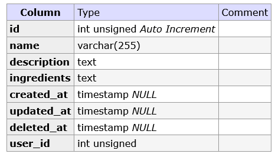

# Jour 7 : Utilisation de l'API et implémentation des commentaires

Le quatrième jour sur le projet O'Cooking (10 Minutes O'Four) est consacré à l'utilisation d'un véritable back-end. On va maintenant utiliser une véritable API pour accéder à nos données. Cela va pas mal changer la façon dont on va accéder à celles-ci, et les manipuler, mais aussi les afficher. L'API utilisée est une API en Laravel, et est disponible dans le dossier [api](./api).

## [Guide d'installation de l'API](./api/installation.md)

Afin de visualiser l'ensemble des routes disponibles, on peut utiliser la commande suivante :

```shell
php artisan route:list
```

## 1. Utilisation de l'API

Lorsque l'on récupère des données via une API, on ne peut pas les manipuler de la même façon que lorsque l'on a accès à une base de données, ni les afficher de la même façon. On va donc devoir adapter notre application pour considérer que la récupération des données sera asynchrone, et que celles-ci ne seront peut-être pas disponibles immédiatement. On va, éventuellement, devoir afficher des informations de chargement, ou attendre que les données soient disponibles avant de les afficher.

### 1.1. Utilisation de l'API au sein de la page d'accueil

#### 1.1.1. Récupération des recettes

- Récupérer les recettes via l'API.

> GET /recipes

Les recettes sont récupérées via l'API. On va utiliser l'API pour récupérer les recettes, et les afficher dans notre application. Pour cela, il est possible d'utiliser [*Axios*](https://axios-http.com/fr/docs/intro) ou [*Fetch*](https://developer.mozilla.org/fr/docs/Web/API/Fetch_API/Using_Fetch) pour effectuer des requêtes HTTP.

On va continuer à utiliser un *store* pour stocker les données de recettes. On laisse aux apprentis développeurs réfléchir où et quand mettre à jour le *store*, en faisant appel à l'API. 

> Bien que pour cette petite application, les considérations de performances sont minimes, dans un cas concret, on veut éviter de faire des appels à l'API à tout moment, et donc de surcharger le serveur, mais on souhaite tout de même avoir des données à jour.

#### 1.1.2. Pagination des recettes

- Paginer les recettes pour afficher 10 recettes par page maximum.

On va toujours récupérer toutes les recettes via l'API, mais on va les paginer pour n'afficher que 10 recettes par page maximum. On va donc, soit ajouter des boutons de navigation pour passer d'une page à l'autre, soit ajouter un bouton "Afficher plus de recettes" affichant 10 recettes en plus (s'il y en a d'autres) au clic. Cela va se faire directement côté client, la pagination n'étant pas gérée par l'API. 

### 1.2. Mise à jour de la page d'une recette

- Modifier l'affichage de la page d'une recette.

En examinant les données renvoyées par l'API, on constate que chaque recette a une description, et une liste d'ingrédients. On va donc mettre à jour la page d'une recette pour afficher ces informations correctement. On peut même afficher le nom de l'utilisateur qui a créé la recette (que l'on récupère également via l'API).

⚠️ La liste des ingrédients est une chaine de caractères, correspondant à du contenu HTML. On laisse le soin aux apprentis développeurs de se documenter pour afficher ce contenu correctement avec Vue.js.

On notera aussi que l'API ne fournit pas de données concernant l'image d'une recette. On va donc utiliser une image par défaut, comme on l'a fait jusqu'à maintenant, pour toutes les recettes, ou aléatoire avec [Lorem Picsum](https://picsum.photos/) par exemple.

### 1.3. Utilisation de l'API à l'ajout d'une recette

- Mettre à jour le formulaire d'ajout d'une recette.

On va maintenant utiliser l'API pour ajouter une recette. On va donc mettre à jour le formulaire d'ajout d'une recette pour envoyer les données via une requête de type `POST`. Il faudra mettre à jour le formulaire pour que les données correspondent à celles attendues par l'API.



⚠️ La liste des ingrédients est une chaine de caractères, correspondant à du contenu HTML avec un saut de ligne entre chaque ingrédient. Il va falloir s'assurer de formater cela correctement, via une `computed property` par exemple.

On ne gère pas encore les utilisateurs. Ainsi, pour le `user_id`, on va utiliser `Math.floor(Math.random() * 28) + 1` pour générer un nombre aléatoire entre 1 et 28 (correspondant aux identifiants des utilisateurs en base de données).

- Envoyer les données d'une nouvelle recette en base de données.

> POST /recipes

On a déjà un formulaire permettant de créer une nouvelle recette et mettre à jour notre liste de recettes. On va maintenant utiliser l'API pour créer une nouvelle recette via une requête de type `POST`.

## 21. Implémentation des commentaires

La page d'une recette contient une section "Commentaires" qui permet de consulter les commentaires associés à la recette.

### 2.1. Récupération des commentaires

- Récupérer les commentaires d'une recette via l'API.

> GET /recipes/{recipe}/comments (avec {recipe} étant l'identifiant de la recette)

Les commentaires sont récupérés via l'API. On va utiliser l'API pour récupérer tous les commentaires propre à une recette depuis la page de la recette. Bien que cela n'ait que peu d'intérêt pour le moment, on va utiliser un *store* pour stocker les données de commentaires. 

### 2.2. Création du composant `CommentComponent`

- Créer le composant `CommentComponent`

On dispose déjà d'un composant pour afficher une liste de commentaires : `CommentListComponent`. On va créer un composant à utiliser au sein de cette liste : `CommentComponent`. On laisse le soin aux apprentis développeur de définir où placer ce composant dans l'arborescence des composants.

### 2.3. Intégration du composant `CommentComponent`

- Intégrer le contenu et le style du composant `CommentComponent`
- Intégrer le composant `CommentComponent` dans le composant `CommentListComponent`

Si une recette contient des commentaires, on affiche la liste des commentaires. Sinon, on affiche un message indiquant qu'il n'y a pas de commentaires : "Aucun commentaire pour cette recette".

